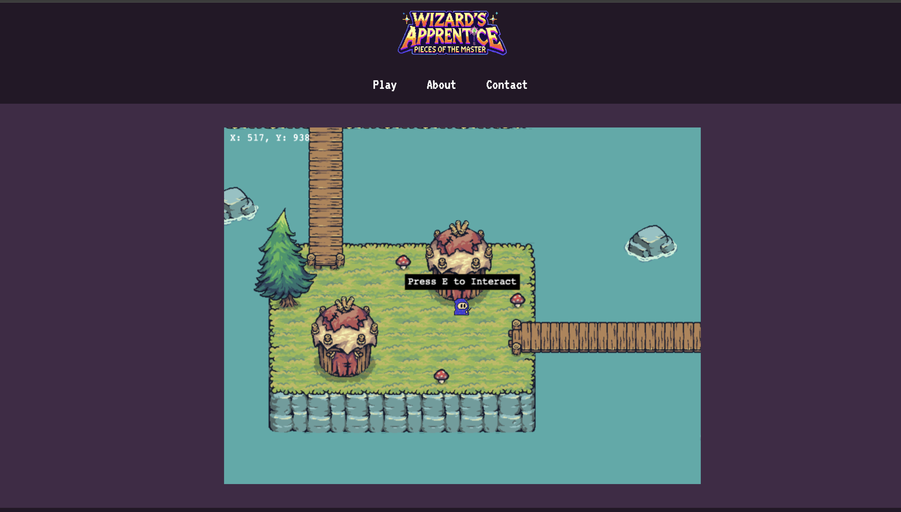
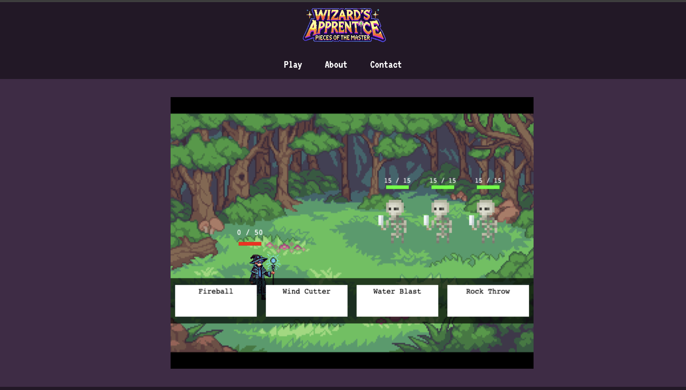

# Wizard's-Apprentice

## Description

Wizard's Apprentice is a MERN stack developed role-playing game that allows you to sign up in order to save your progress. The start of the game takes you to the Dimension of Magic (DOM) where you can then explore other levels and engage in turn based battle with opponents. The game will also have an option to donate to the creators for further development. 

## User Story

```md
AS a wizards apprentice,
I want to navigate the Dimension of Magic (DOM) map,
SO that I can roam new areas, encounter opponents, and engage in turn-based battle.
```

## Acceptance Criteria

```md
GIVEN a role-playing game.
WHEN I load the webpage.
THEN I am presented with a home page with a signup/login screen.
WHEN I login I will be taken to the Home Screen with a menu option..
THEN I can select to play a new game or continue an existing game.
WHEN I am in the map I will be able to roam different areas of the map. THEN I can complete side quest as well as engage in turn-based battle with opponents.

WHEN I need to step away, and save progress I will be able to click "Enter" and will be given an option to save.
THEN my progress will be saved and will be able to pick back up where i left off.
```

## Usage

To try out the game visit this link. [Link](https://wizard-s-apprentice.onrender.com)

Checkout the GitHub Repository link. [Link](https://github.com/nearias3/Wizard-s-Apprentice)

## Built With:

- React
- Express
- MongoDB
- Mongoose
- GraphQL
- Phaser
- Tiled

## Preview






## Credits

- Nicole Arias
- Ken Wagner
- Connor Neale
- Adalberto Morones
